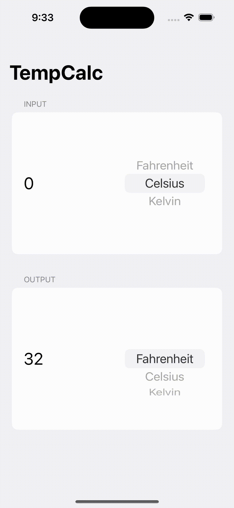

# TempCalc
A unit conversion app that can convert temperature into Fahrenheit, Celsius, or Kelvin.

## Featuring
- Measurement (Structure)
- UnitTemperature (Class)
- Observation

## App Preview
*Please wait for the demo GIF to load*

  

## LICENSE

[MIT](LICENSE)
